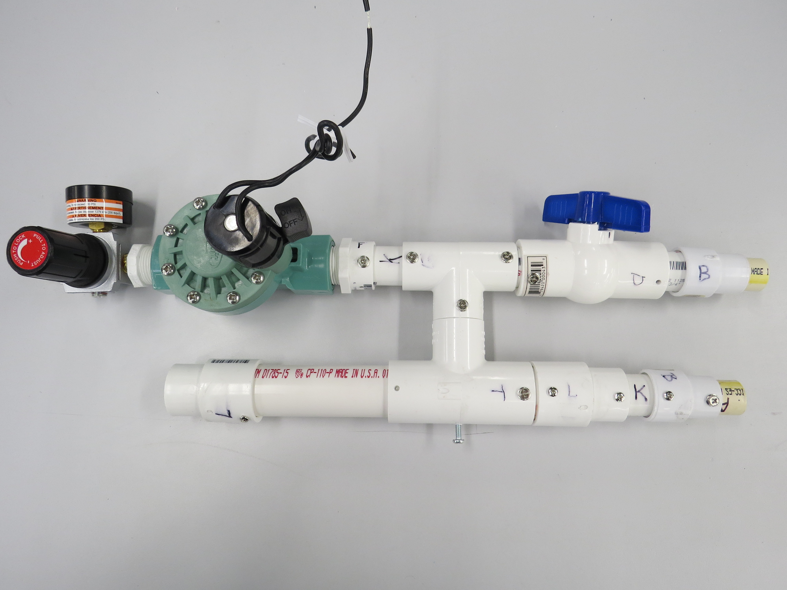

# UF Open Source Ventilator Project - MBX Systems Proposed Merge
MBX Fork
Forked from the UFHealth CSSALT Lab project for an open source ventilator design, this fork contains detailed assembly documentation, clarified bill of materials, electrical schematics and updated controller code. Our goal is to have these contributions pulled into the core project to help accellerate public adoption of the project.
---------------------------------

MBX Contributions:
-Bill of Material
* **Clear and transparent bill of materials** Full bill of materials has been updated and refined to include additional clarity and detail on the raw material requirements.
https://docs.google.com/spreadsheets/d/1ovyo2lUL0noa83XnP0gwtcc2B9GDPE4pJonda6fv0Mo/edit?usp=sharing

-Mechanical Drawings of the ventilator
See Drawing folder for both drawings and exploded view video
Models will be coming soon on Onshape

-Build Instructions:
Full Build assembly for 1.2v CSSALT design as well as MBX localization design
* **Full assembly documentation via Dozuki** Free and open, updated project documentation hosted by Dozuki. Documentation can now be refined in a community driven manner while still maintaining the integratity of version control.
https://www.opensourceventilation.org/

-Schematic
Schematic is located here: https://upverter.com/design/mbx/b782985665a208aa/
Schematic does not include pressure controls, but it does allows for dual inline valve control which is implemented in the current code.

-Control Source Code -ArduinoVent
Added a branch to run test without pressure sensor. Information about test program is located on test plan folder

  

