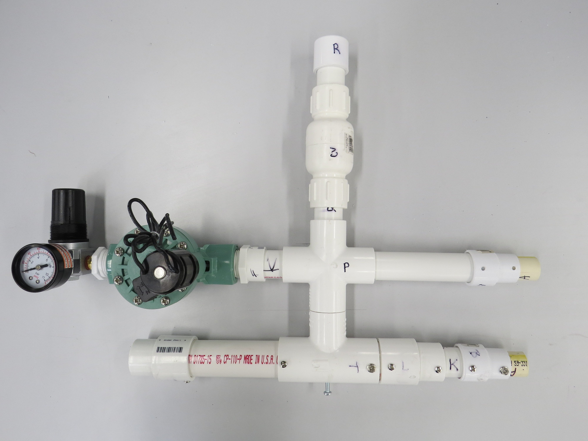

# UF Open Source Ventilator Project - MBX Systems Proposed Merge

Forked from the UFHealth CSSALT Lab project for an open source ventilator design, this fork contains detailed assembly documentation, clarified bill of materials, electrical schematics and updated controller code.

**Our goal is to have these contributions pulled into the core project to help accellerate public adoption of the project.**

The following updates have been made to the project and are publicly available with the intent to turn it over to the orginal UFHealth team:

* **Full assembly documentation via Dozuki** Free and open, updated project documentation hosted by Dozuki. Documentation can now be refined in a community driven manner while still maintaining the integrity of version control.
https://www.opensourceventilation.org/Guide/Open+Source+Ventilator+Assembly+(MBX+v1)/4?lang=en

* **3D assemblies** Full 3D assemblies rendered for the entire build.
-need link-

* **Clear and transparent bill of materials** Full bill of materials has been updated and refined to include additional clarity and detail on the raw material requirements.
https://docs.google.com/spreadsheets/d/1ovyo2lUL0noa83XnP0gwtcc2B9GDPE4pJonda6fv0Mo/edit?usp=sharing

* **Detailed controller schematics** 
Schematic is located here: https://upverter.com/design/mbx/b782985665a208aa/
Schematic does not include pressure controls, but it does allows for dual inline valve control which is implemented in the current code.

* **-Control Source Code Updates** -ArduinoVent Added a branch to run test without pressure sensor. Information about test program is located on test plan folder

#### Example of respirator function without controller

The original project can be found here: https://simulation.health.ufl.edu/technology-development/open-source-ventilator-project/

